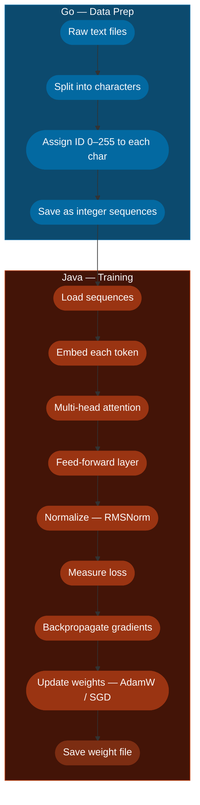
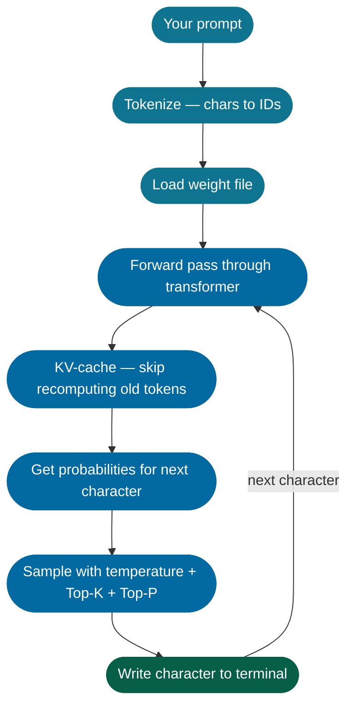
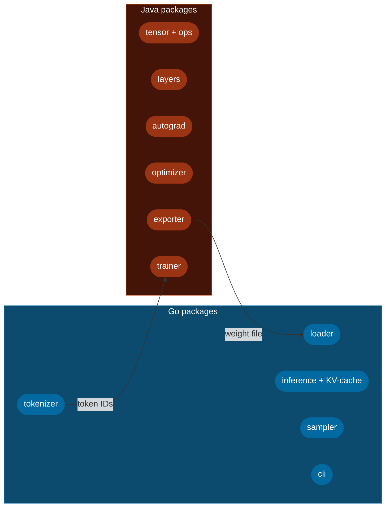

<h1 align="center">
  <span style="color:#00ADD8;font-size:2em;font-weight:800;letter-spacing:-1px;">Micro</span><span style="color:#E76F00;font-size:2em;font-weight:800;letter-spacing:-1px;">LLM</span>
</h1>

<p align="center" style="font-size:1.15em;color:#6b7280;max-width:600px;margin:0 auto;">
  A language model built from scratch — no Python, no cloud, no magic boxes.<br/>
  Just <strong style="color:#00ADD8;">Go</strong> and <strong style="color:#E76F00;">Java</strong> doing everything from raw text to generated output.
</p>

<br/>

<p align="center">
  
</p>

<br/>

---

<h2 align="center" style="font-size:1.5em;font-weight:800;letter-spacing:0.08em;">
  <span style="color:#00ADD8;">TWO LANGUAGES.</span>
  <span style="color:#E76F00;"> ONE PIPELINE.</span>
  <span style="color:#a855f7;"> ZERO MAGIC.</span>
</h2>

<p align="center" style="font-size:1.05em;margin-top:0.5em;">
  <strong style="color:#00ADD8;font-size:1.15em;">Go</strong>
  <span style="color:#94a3b8;"> &mdash; </span>
  <span style="color:#22c55e;">tokenize text</span>
  <span style="color:#94a3b8;"> &nbsp;&middot;&nbsp; </span>
  <span style="color:#38bdf8;">load weights</span>
  <span style="color:#94a3b8;"> &nbsp;&middot;&nbsp; </span>
  <span style="color:#818cf8;">run inference</span>
  <span style="color:#94a3b8;"> &nbsp;&middot;&nbsp; </span>
  <span style="color:#34d399;">stream output</span>
</p>

<p align="center" style="font-size:1.05em;">
  <strong style="color:#E76F00;font-size:1.15em;">Java</strong>
  <span style="color:#94a3b8;"> &mdash; </span>
  <span style="color:#fb923c;">build the transformer</span>
  <span style="color:#94a3b8;"> &nbsp;&middot;&nbsp; </span>
  <span style="color:#f59e0b;">backpropagate</span>
  <span style="color:#94a3b8;"> &nbsp;&middot;&nbsp; </span>
  <span style="color:#ef4444;">optimize</span>
  <span style="color:#94a3b8;"> &nbsp;&middot;&nbsp; </span>
  <span style="color:#e879f9;">export weights</span>
</p>

---

## What this is

You drop a few megabytes of text in a folder. Java trains a small transformer on it — learning which characters tend to follow which. Then you run Go with any prompt and it streams text back to your terminal, one character at a time.

Every part is written by hand. No ML frameworks, no Python, no GPU required. Training takes minutes on a regular laptop.

---

## Color guide

| Color | Side | Job |
|-------|------|-----|
| **`#00ADD8` blue** | Go | Tokenize text, load weights, run the model, stream answers |
| **`#E76F00` orange** | Java | Tensor math, transformer layers, backprop, optimizer, weight export |
| **`#64748B` slate** | Shared | Data files and weight files used by both sides |

---

## The full pipeline


---

## Phase 1 — Training

**Go** turns raw text into numbers. **Java** trains the model on those numbers and saves the result.



### What each step means

| Step | Who | Plain meaning |
|------|-----|---------------|
| Character split | Go | Break the text into individual letters and symbols |
| Assign IDs | Go | Give every character a number (0 to 255) |
| Save sequences | Go | Write those numbers to disk so Java can read them |
| Embed tokens | Java | Turn each number into a small list of floats the model can work with |
| Attention | Java | Let each character look at surrounding characters to understand context |
| Feed-forward | Java | Extra processing step after attention — adds depth |
| RMSNorm | Java | Keeps the numbers from getting too big or too small during training |
| Loss | Java | Measures how wrong the model's prediction was |
| Backprop | Java | Figures out which weights caused the mistake |
| Optimizer | Java | Nudges every weight slightly in the right direction |
| Export | Java | Saves everything the model learned into a file |

---

## Phase 2 — Inference

Only **Go** here. No Java, no training loop — just load the weights and generate.



### The sampler — three knobs

| Knob | What it does |
|------|-------------|
| Temperature | Low = safe and predictable. High = creative and surprising |
| Top-K | Only consider the K most likely next characters |
| Top-P | Only consider characters that together make up P% of the probability mass |

The KV-cache is a speed trick — Go stores the attention results for characters it already processed, so each new character only needs one forward step instead of recomputing everything from scratch.

---

## Module breakdown



---

## Project layout

```
micro-llm/
├── go/
│   ├── cmd/
│   │   ├── tokenize/       ← tokenize a raw text corpus
│   │   └── generate/       ← generate text from a prompt
│   └── internal/
│       ├── tokenizer/      ← build vocab, encode, decode
│       ├── loader/         ← read exported weight file
│       ├── inference/      ← forward pass + KV-cache
│       ├── sampler/        ← temperature, top-k, top-p
│       └── cli/            ← wires all packages together
│
├── java/
│   └── src/main/java/com/microllm/
│       ├── tensor/         ← Tensor class and math ops
│       ├── layers/         ← Embedding, Attention, FFN, Norm
│       ├── autograd/       ← Variable graph + backprop engine
│       ├── optim/          ← AdamW and SGD
│       ├── model/          ← Transformer, TransformerBlock, ModelConfig
│       ├── train/          ← Trainer, Loss, TokenDataset
│       └── export/         ← WeightExporter
│
├── data/
│   ├── raw/                ← put your .txt files here
│   └── tokenized/          ← Go writes integer sequences here
│
├── models/
│   └── exported/           ← Java writes weights here, Go reads them
│
└── scripts/
    ├── tokenize.sh
    ├── train.sh
    └── generate.sh
```

---

## Running it

```bash
# step 1 — put your text in data/raw/ then tokenize it
bash scripts/tokenize.sh

# step 2 — train the model (Java)
bash scripts/train.sh

# step 3 — generate from a prompt (Go)
bash scripts/generate.sh
```

---

## Scale — built for a laptop

No cloud, no GPU, no special hardware.

| Setting | Value | Why |
|---------|-------|-----|
| Vocab size | ~256 chars | One ID per printable character — tiny lookup table |
| Layers | 2 – 4 | Deep enough to learn patterns, light enough to run fast |
| Model width | 64 or 128 | Stays within normal CPU cache |
| Attention heads | 2 – 4 | Enough for this scale |
| Parameters | ~1 million | Trains in minutes, not hours |
| Dataset size | 1 – 2 MB text | A play, short stories, or small code files |
| Training RAM | < 20 MB | Laptop stays usable while training |
| Inference RAM | < 10 MB | Answers come back fast |

---

<br/>

<p align="center" style="font-size:1.2em;letter-spacing:0.04em;">
  <code style="color:#00ADD8;font-size:1.1em;">text</code>
  <span style="color:#94a3b8;"> &rarr; </span>
  <code style="color:#00ADD8;font-size:1.1em;">Go tokenizes</code>
  <span style="color:#94a3b8;"> &rarr; </span>
  <code style="color:#E76F00;font-size:1.1em;">Java trains</code>
  <span style="color:#94a3b8;"> &rarr; </span>
  <code style="color:#64748B;font-size:1.1em;">weights</code>
  <span style="color:#94a3b8;"> &rarr; </span>
  <code style="color:#00ADD8;font-size:1.1em;">Go generates</code>
</p>

<p align="center">
  <a href="docs/ARCHITECTURE.md">Architecture deep-dive &rarr;</a>
</p>
